# Olympics Data Exploration

## Dataset

 I used data sets of **"120-years-of-olympic-history-athletes-and-results"** in [Kaggele](https://www.kaggle.com/heesoo37/120-years-of-olympic-history-athletes-and-results) which has information about players , their teams , medals and gender

The data consists of information regarding 271116 rows and includes  :

- Event related : 
    - City
    - Year
- Athlete related:
    - Sport
    - Age
    - Weight
    - Height
    - Medal
    - Name
    - Team
    - region
    - notes

## Summary of Findings

#### we find most hosting cities as follows

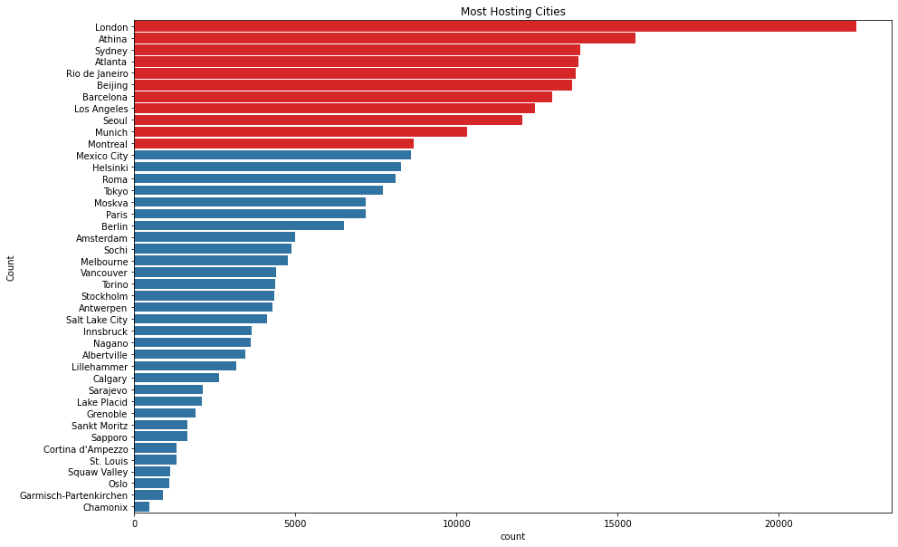
#### Most contributors at 25 years old
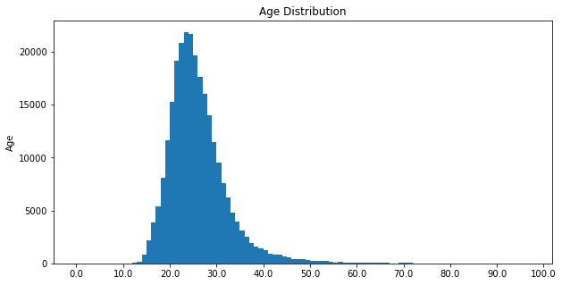
- #### Olympics popularity increases every year but the winter season has less players
- #### from 1994 olympics has one season every year

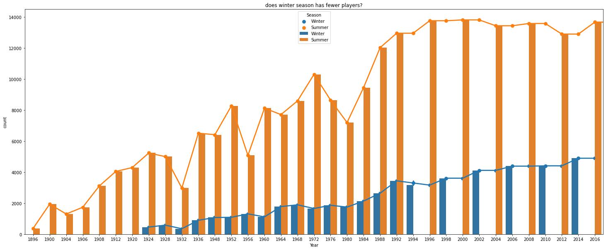
#### there are most contributors
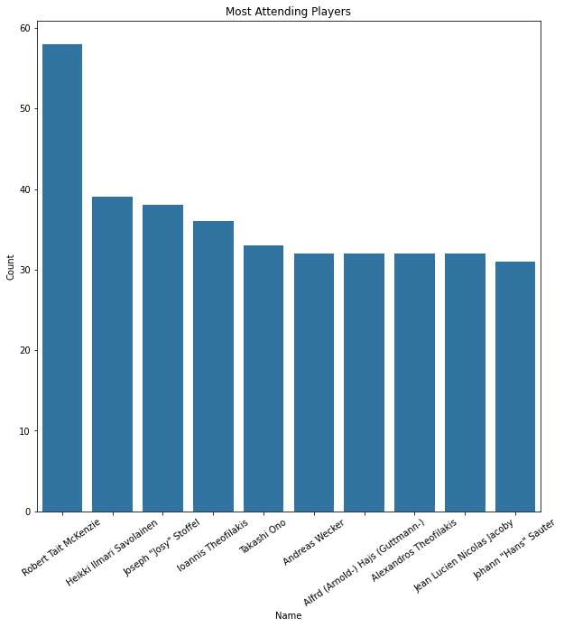
#### those are independent teams 
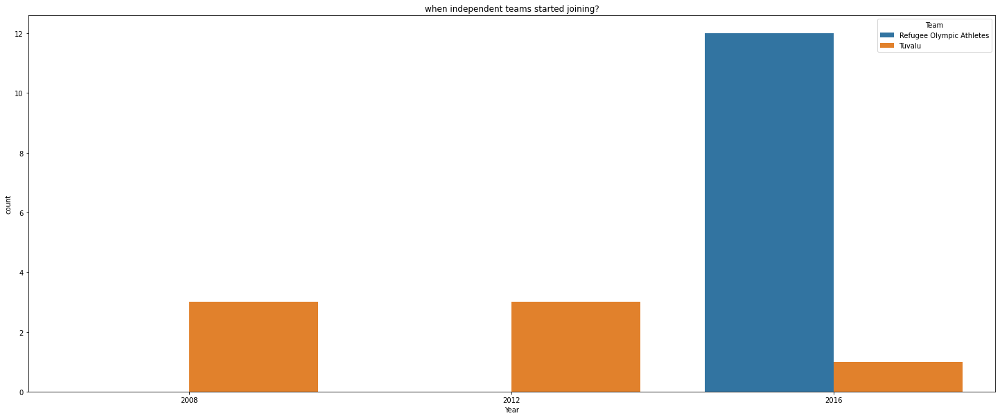

#### We find Arts very  has different age distribution due to less physical effort 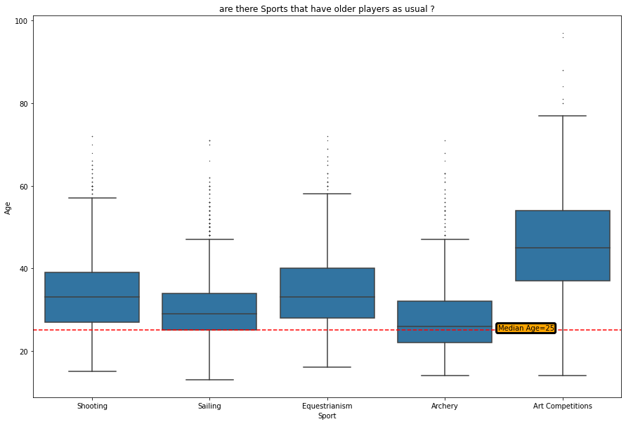

#### Basketball must have higher players than others
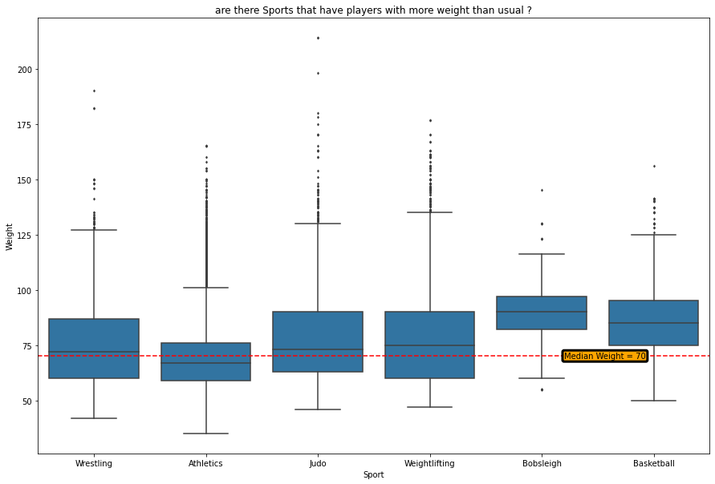
#### Gym's most players are shorter
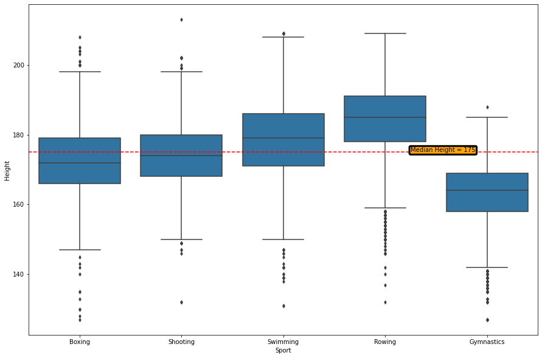
#### Most sports popularity are increasing but arts has no longer any players since 1948
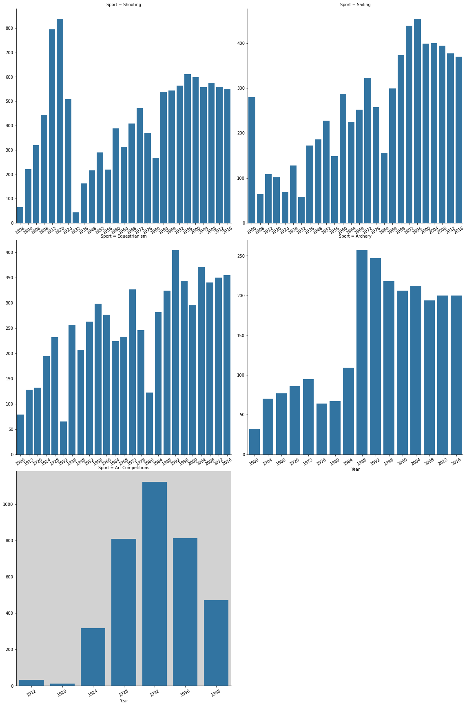
#### those are best players for each medal
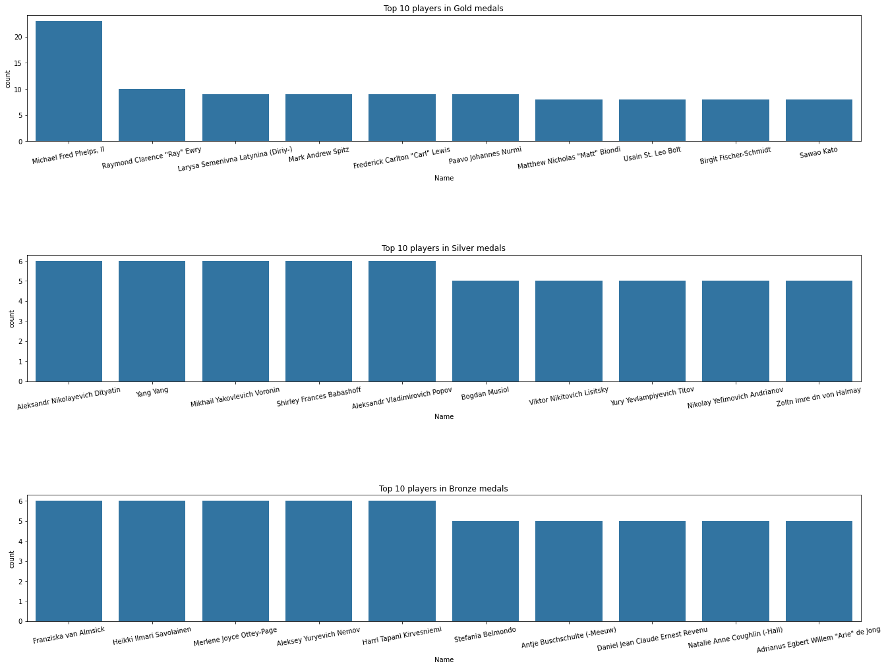
#### women appear to have similar trend in winter like men but men have larger trend in summer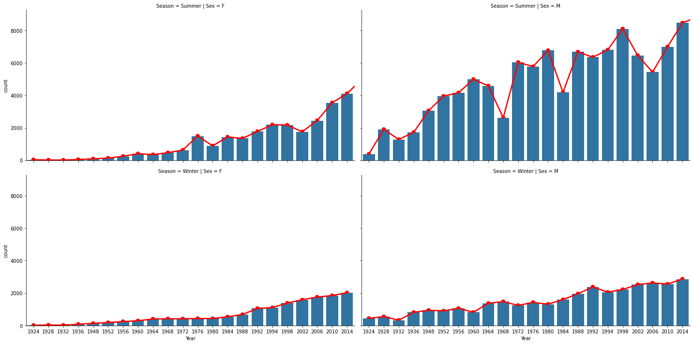
#### we can focus on players from 20to30 years with Height/Weight ratio 2to2.50 to support for medals
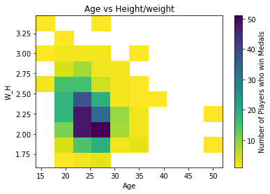

## Key Insights for Presentation

I focused on distribution of :

- age
- height
- weight

and separated outliers by their sport for further analysis to find sports with different distribution 

I focused on frequency of players and started to generate several plots depending on :

- sex 
- year 
- medals 
- season
- height and weight
  - to reach that:
    -  women trend grew to be similar to men over winter season
    - most winning players prefect height ,weight and age
    - sports that are stopped in olympics like arts
